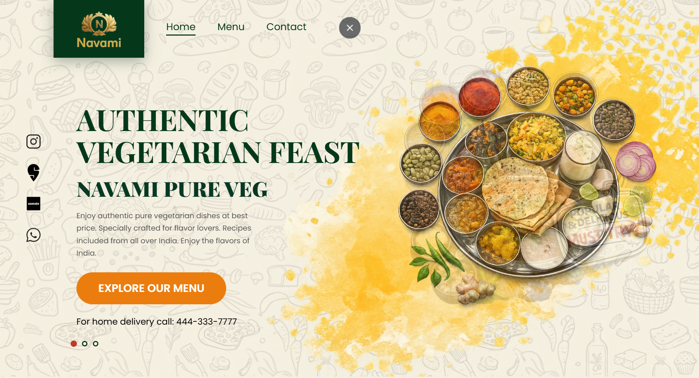

<div align="center">

  

  <p align="center">
    <strong>A modern dining interface designed & developed by <a href="https://github.com/Adinath-Jagtap">Adinath Jagtap</a></strong>
  </p>

  <p align="center">
    <a href="https://restaurant-frontend-demo.vercel.app/" target="_blank">
      
    </a>
    &nbsp;
    <a href="https://github.com/Adinath-Jagtap" target="_blank">
      
    </a>
    &nbsp;
    
  </p>

  <br/>

  <!-- Project Preview Banner -->
  <a href="https://restaurant-frontend-demo.vercel.app/" target="_blank">
    
  </a>

  <br/><br/>

</div>

---

### ✦ Overview & Intent

An exploratory frontend project designed for a contemporary plant-based dining concept. The objective was to design and engineer an immersive, editorial-grade restaurant interface from scratch — prioritizing rich visual storytelling, fluid micro-interactions, and instant load performance without relying on third-party UI libraries or bulky frameworks.

---

### ✦ Visual & Interaction Design

* **Editorial Typography** — Paired the stately elegance of *Playfair Display* for grand editorial headings with *Poppins* for geometric clarity and effortless menu readability.
* **Warm Earth & Saffron Palette** — Bespoke color system derived from artisanal Indian spices, warm cream undertones, and gold accents.
* **Dynamic Dish Showcase** — Synchronized carousel featuring floating dish reveals with warm radiant backdrops.
* **Pure CSS Choreography** — Smooth transitions, hover depths, button micro-states, and glassmorphic navigation blur.
* **Responsive Architecture** — Designed mobile-first with a custom off-canvas navigation drawer and touch-friendly tap targets.

---

### ✦ Project Anatomy

```
├── index.html        # Landing page — Hero showcase, experience story, and contact
├── menu.html         # Interactive culinary menu with multi-category listings
├── 404.html          # Custom styled not-found experience
└── style/
    ├── style.css     # Bespoke design tokens, typography, and animations
    └── images/       # High-resolution dish plates, branding, and textures
```

---

### ✦ Technology & Standards

| Layer | Implementation |
|---|---|
| **Structure** | Semantic HTML5, ARIA labels, structured Open Graph meta tags |
| **Styling** | Modern CSS3 (Custom Properties, Flexbox, CSS Grid, Media Queries) |
| **Logic** | Lightweight Vanilla JavaScript (DOM state, slideshow timer, mobile drawer) |
| **Typography** | Google Fonts (*Playfair Display* & *Poppins*) |
| **Deployment** | Vercel Edge Network |

---

<div align="center">

  <a href="https://restaurant-frontend-demo.vercel.app/" target="_blank">
    
  </a>

  <br/><br/>

  <h3>✦ Designed & Developed by Adinath Jagtap</h3>
  <p>Frontend Developer & UI Designer • Clean Architecture, Vanilla Web & Kinetic Interfaces</p>

  <p>
    <a href="https://github.com/Adinath-Jagtap" target="_blank">
      
    </a>
    &nbsp;
    <a href="mailto:adinathjagtap9702@gmail.com">
      
    </a>
  </p>

</div>

